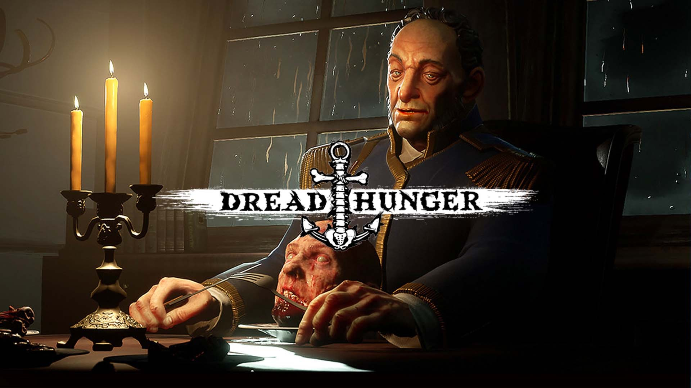

---

**NOTE**: As of 2024-01-01, **dread hunger is no longer supported by the developer and cannot be purchased from steam**.
This means you must already own the game on steam or otherwise have access to the files in order to be able to build this image.

A docker image for running a dedicated server for the game [Dread Hunger](https://store.steampowered.com/app/1418630/Dread_Hunger/) on linux.

## Usage

### Building and Running

To build the docker image for this server and run it locally:

1. Clone this repository: `git clone https://github.com/Laura7089/dread-hunger-docker.git`.
2. Copy (or otherwise link) the `LinuxServer` directory from your game installation into the cloned repository.
3. Build the image: `docker build -t dread-hunger .` (this may need `sudo`).
4. Run the server: `docker run -d -p 7777:7777/udp dread-hunger` (this may also need `sudo`).

To do this usefully, you **must** have some way for other players to see your server.
How to do this is out of the scope of this guide, but usually involves either port forwarding or using a dedicated server machine.

### Connecting

1. Open the game.
<!-- TODO: does this change any settings on the server??? -->
2. Open the map table, and create a lobby. 
<!-- TODO: how do players do this? -->
3. Assemble your players.
4. When you're ready, light the boiler and sail the ship out of the harbour as normal.
5. You will be presented with a prompt for an IP address.
  Enter the IP address for the machine that is hosting your server (see above).
  If you've changed the port with the `-p` parameter to docker, change the port from the default too.
6. You and your players should connect. Enjoy!

## Licensing

The contents of this repo (except the banner image) are licensed under the GNU Affero General Public License.
Dread Hunger is the property of Digital Confectioners; no credit is taken for the software in this image.
